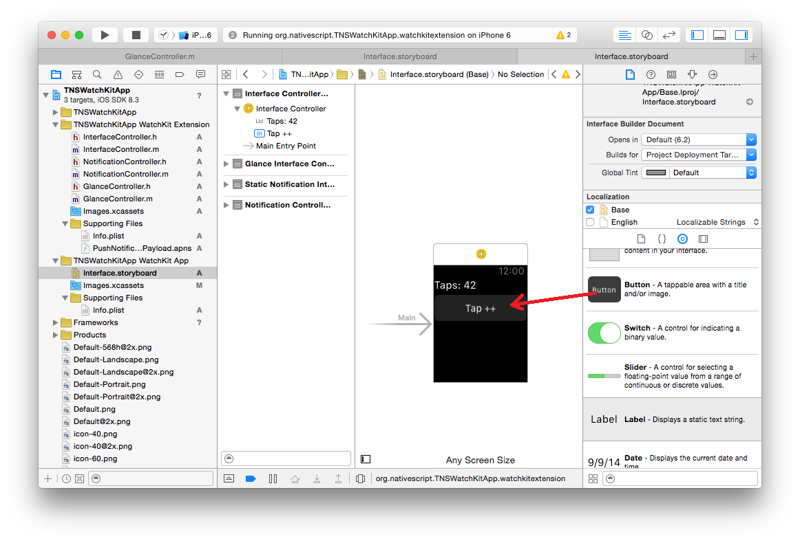

# TNS WatchKit App
This is an example with NativeScript for iOS and the WatchKit APIs.

## Walkthrough
To set up a project:
```bash
tns create project TNSWatchKitApp
cd TNSWatchKitApp
tns platform add ios
tns prepare ios
```

Open the Xcode project in `/platforms/ios/TNSWatchKitApp.xcodeproj`.
> **NOTE:** To manually set up a WatchKit extension with NativeScript you will have to work in Xcode. This is not supported from the CLI yet.

### Add WatchKit Extension
Go to `File > New > Target` and select `Apple Watch > WatchKit App`.
In the dialogue set:
 - [x] Include Notification Scene.
 - [x] Include Glance Scene.

### Xcode Quirks
##### Set the Deployment Target to iOS 8.2
Click on the TNSWathcKitApp to open the targets and set the deployment targets to **iOS8.2** in:
 - `Targets > TNSWathcKitApp WatchKit App > Build Settings > iOS Deployment Target`

> **NOTE:** This may change in future. I have the iOS8.3 SDK and my Xcode generates the WatchKit App extensions with deployment target set to iOS8.3.

##### Set Bundle Versions
I had CFBundleVersion missmatch in the Info.plist files in:
 - `TNSWathcKitApp WatchKit Extension > Supporting Files > Info.plist > ` (was '1.0')
 - `TNSWatchKitApp WatchKit App > Supporting Files > Info.plist > Bundle version` (was '1')

Just set it to '1.0' everywhere to perfectly match the version string.

##### Open the WatchKit simulator
Run `TNSWatchKitApp WatchKit App` in `iPhone 6` simulator. Select the simulator and show the watch display from: `Hardware > External Displays > Apple Watch - 42mm`.

It should be still blank.

### Add Some UI in the Storyboards
Click on the `TNSWatchKitApp > TNSWatchKitApp WatchKit App > Interface.storyboard` to open the interface builder.
From the widgets menu drag a label and a button on the small clock the "Main" arrow points to.



Note that you have `WatchKit Extension` and `WatchKit App` pair. The _App_ is deployed on the watch and has storyboards describing the UI. The _Extension_ will be executed on the phone and will handle input and changes. [There is a nice overview of the framework in the apple's documentation](https://developer.apple.com/library/ios/documentation/General/Conceptual/WatchKitProgrammingGuide/DesigningaWatchKitApp.html#//apple_ref/doc/uid/TP40014969-CH3-SW1).

### Replace the Static NativeScript.framework with the Shared NativeScript.framework
> **NOTE:** We plan to distribute the NativeScriptEmbedded.framework in "tns-ios" in a "NativeScriptEmbedded/" folder of sort.

Open the `Targets > TNSWatchKitApp > Build Phases > Link Binary With Libraryes` and remove the static _NativeScript.framework_ from there.

Then from the _NativeScriptEmbedded_ folder add the shared _NativeScript.framework_ to:
 - `Targets > TNSWatchKitApp > General > Embedded Binaries`
 - `Targets > TNSWatchKitApp WatchKit Extension > `

### Add Metadata in the Extension
You also have to add metadata in the Extension to support the Objective-C APIs in JavaScript. You need to copy the metadata build phase from the app.

Get to the `Targes> TNSWatchKitApp WatchKit Extension > Build Phases` and add new `Run Script Phase` executing the following:
```bash
pushd "$SRCROOT/metadataGenerator/bin"
./metadata-generation-build-step.sh
popd
```

Check if the app is running.

### Bootstrap the NativeScript in the Extension
Go to the `TNSWatchKitApp/platforms/ios/TNSWatchKitApp WatchKit App` folder and create `app` folder with `app.js` inside:
```bash
.
├── Base.lproj
................
├── Info.plist
└── app
    └── bootstrap.js
```

bootstrap.js:
```
console.log("Hello World!");
```

And add the `app` folder to the _TNSWatchKitApp WatchKit Extension_ as reference. It should look similar to the _TNSWatchKitApp_'s _app_.

You also need to add a `main.m` file in `TNSWatchKitApp WatchKit Extension/Supporting Files` to bootstrap the runtime.
``` Objective-C
#include <NativeScript/NativeScript.h>

static TNSRuntime* runtime;

int main() {
    runtime = [[TNSRuntime alloc] initWithApplicationPath:[NSBundle mainBundle].bundlePath];
    TNSRuntimeInspector.logsToSystemConsole = YES;
    [runtime executeModule:@"./"];
    return 0;
}
```

If you run the 'TNSWathcKitApp WatchKit App` now the bootstrap.js will execute printing "Hello World!" in the console.

### Implementing the Controllers using NativeScript
The next step will be to implement the controllers in app.js:
 - InterfaceController.m
 - NotificationController.m
 - GlanceController.m

> **NOTE:** Building the WatchKit App interface will use the storyboards and will require the controller headers at compile time. We plan to solve this by providing our own templates that will allow you to focus on the JavaScript.

> **NOTE:** We will try to implement all that work in the CLI so you can start up from here.


